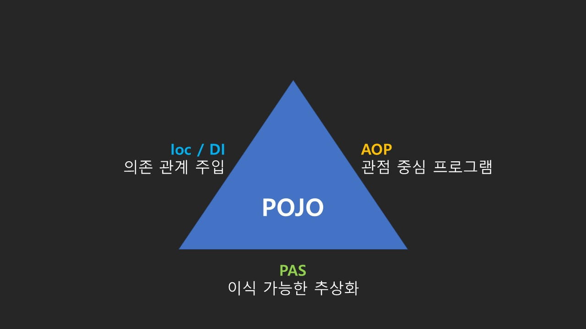

## 목차

- [WEB](#web)
- [Spring](#spring)
  - [IoC (Inversion of Control)](#ioc-inversion-of-control)
    - [예제 코드](#예제-코드)
  - [DI (Dependency Injection)](#di-dependency-injection)
  - [AOP (Aspect Oriented Programming)](#aop-aspect-oriented-programming)
    - [관점 지향 프로그램](#관점-지향-프로그램)
    - [주요 Annotation](#주요-annotation)
    - [예제 코드](#예제-코드-1)
- [Spring boot](#spring-boot)

# WEB

- [WEB 개요](./1_web)

# Spring

- Spring 1.0 버전은 2004년 3월 출시
  - 지난 20년까지의 세월 동안 단 한번도 자바 엔터프라이즈 어플리케이션 개발의 최고의 자리를 차지
- 스프링 프레임워크의 구성은 20여가지의 구성(https://spring.io/projects/spring-framework)
  - 이러한 모듈들은 스프링의 핵심기능(DI, AOP, etc)을 제공해 주며, 필요한 모들만 선택하여 사용 가능.
- 현재 단일 아키텍처(모놀리스)마이크로서비스 아키텍처로 변환 중
- 여러 가지 모듈이 있지만 그 중에서 단연
  - **스프링 부트, 스프링 클라우드, 스프링 데이터, 스프링 배치, 스프링 시큐리티**에 중점을 둔다.
- Spring의 과제는 "테스트의 용이성", "느슨한 결합"에 중점을 두고 개발
- 2000년대 초의 자바 EE 애플리케이션은 작성/테스트가 매우 어려웠으며, 한번 테스트하기가 번거로웠다. 이로 인하여, 느슨한 결합이 된 애플리케이션 개발이 힘든 상태였으며, 특히 데이터베이스와 같이 외부에 의존성을 두는 경우 단위테스트가 불가능했다.
- IoC의 등장
  - 스프링이 다른 프레임워크와 가장 큰 차이점이 IoC를 통한 개발 진행
- AOP
  - AOP를 사용하여, 로깅, 트랜잭션 관리, 시큐리티에서의 적용 등 AspectJ와 같이 완벽하게 구현된 AOP와 통합하여 사용 가능하다.

## IoC (Inversion of Control)

- 스프링에서는 일반적인 Java 객체를 new로 생성하여 개발자가 관리 하는 것이 아닌 Spring Contrainer에 모두 맡긴다.
- 즉, 개발자에서 -> 프레임워크로 **제어**의 객체 관리의 **권한이 넘어 갔음** 으로 **"제어의 역전"** 이라고 한다.

### 예제 코드

- [java ioc / di](./3_ioc)
- [spring ioc](./4_spring-ioc)

## DI (Dependency Injection)

- 장점
  - 의존성으로 부터 격리시켜 코드 테스트에 용이하다.
  - DI를 통하여, 불가능한 상황을 Mock와 같은 기술을 통하여, 안정적으로 테스트 가능하다.
  - 코드를 확장하거나 변경 할때 영향을 최소화 한다. (추상화)
  - 순환참조를 막을 수 있다.

## AOP (Aspect Oriented Programming)

### 관점 지향 프로그램

스프링 어플리케이션은 대부분 특별한 경우를 제외 하고는 MVC 웹 어플리케이션에서는 Web Layer, Business Layer, Data Layer 로 정의

- Web Layer : REST API 를 제공하며, Client 중심의 로직 적용
- Business Layer : 내부 정책에 따른 logic을 개발하여, 주로 해당 부분을 개발
- Date Layer : 데이터 베이스 및 외부와의 연동을 처리

### 주요 Annotation

|Annotation|의미|
|---|---|
|`@Aspect`|자비에서 널리 사용하는 AOP 프레임워크에 포함되며, AOP를 정의하는 Class에 할당|
|`@Pointcut`|기능을 어디에 적용시킬지, 메소드? Annotation? 등 AOP를 적용 시킬 지점을 설정|
|`@Before`|메소드 실행하기 이전|
|`@After`|메소드가 성공적으로 실행 후, 예외가 발생 되더라도 실행|
|`@AfterReturing`|메소드 호출 성공 실행 시 (Not Throws)|
|`@AfterThrowing`|메소드 호출 실패 예외 발생 (Throws)|
|`@Around`|Before / After 모두 제어|

### 예제 코드

- [aop](./5_aop)

# Spring boot

- [스프링부트 개요](./2_spring_boot)